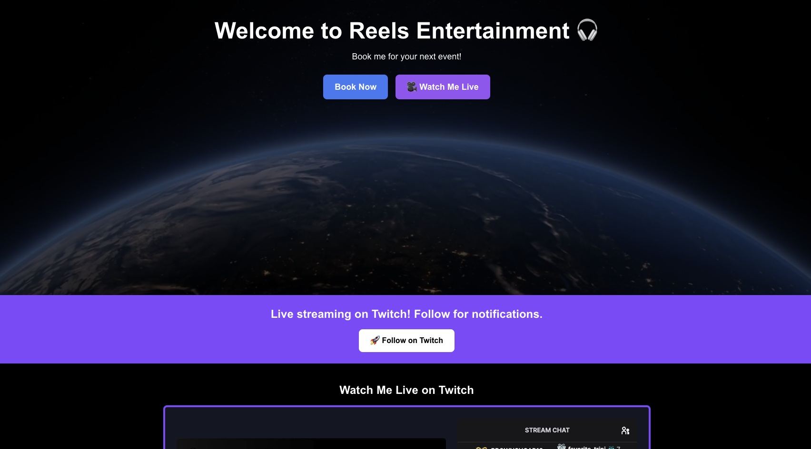

# Reels Entertainment - Next.js Website

Welcome to **Reels Entertainment**, a fully responsive Next.js-based website featuring live Twitch streaming integration, smooth animations, and an immersive user experience. This project is deployed on Vercel and optimized for SEO.

## 🚀 Features

- 🎥 **Twitch Live Streaming** - Watch DJ Reels perform live on Twitch directly on the website.
- 📅 **Event Scheduling** - Displays upcoming DJ stream schedules.
- 🎭 **Smooth Animations** - Built with Framer Motion for enhanced UI interactions.
- 💌 **Contact Form with Nodemailer** - Allows users to send booking inquiries.
- 🌠 **Shooting Stars Effect** - Animated background with moving stars.
- 🖼 **Image & Video Carousel** - Interactive Swiper-based past event showcase.
- 🌙 **Dark Mode Support** - Tailwind CSS-based theme adaptation.
- 📈 **SEO Optimized** - Metadata and structured data for improved search ranking.

## 🛠 Tech Stack

- **Frontend:** Next.js 15, React 19, TypeScript, Tailwind CSS
- **UI Animations:** Framer Motion
- **Forms & Validation:** React Hook Form
- **Streaming API:** Twitch Embed
- **Email Service:** Nodemailer (via Gmail SMTP)
- **Deployment:** Vercel

## 📂 Folder Structure

```
reels-entertainment/
├── .next/                  # Compiled Next.js build files
├── .vercel/                # Vercel configuration
├── node_modules/           # Dependencies
├── public/                 # Static assets (images, videos, etc.)
├── src/
│   ├── app/
│   │   ├── api/
│   │   │   ├── contact/route.ts  # Nodemailer API route
│   │   ├── components/
│   │   │   ├── About.tsx         # About section
│   │   │   ├── ContactForm.tsx   # Contact form component
│   │   │   ├── ShootingStars.tsx # Animated stars background
│   │   ├── globals.css           # Global styles
│   │   ├── layout.tsx            # Main layout including Footer
│   │   ├── page.tsx              # Home page
├── .gitignore
├── package.json
├── tsconfig.json
├── tailwind.config.ts
├── README.md                     # You're here!
```

## 🚀 Getting Started

### 1️⃣ Clone the Repository
```bash
git clone https://github.com/JonJon50/Reels-Entertainment.git
cd Reels-Entertainment
```

### 2️⃣ Install Dependencies
```bash
npm install
# or
yarn install
```

### 3️⃣ Create a `.env.local` File

```env
EMAIL_USER=your-email@gmail.com
EMAIL_PASS=your-app-password
```

> **Note:** You may need to enable "Less Secure Apps" or create an App Password in your Gmail account.

### 4️⃣ Run Development Server
```bash
npm run dev
```
Open [http://localhost:3000](http://localhost:3000) in your browser.

## 🌍 Deploying on Vercel

This project is already configured for Vercel. To deploy:

1. Push changes to GitHub.
2. Connect your repo on [Vercel](https://vercel.com/).
3. Set environment variables in **Vercel Dashboard > Settings**.
4. Deploy automatically!

## 📸 Screenshots

 *(Replace with actual image link)*

## 📢 Contributing

Pull requests are welcome! Open an issue if you find bugs or have feature requests.

## 📜 License

This project is licensed under the MIT License.

---

_Developed by [John Hagens](https://github.com/JonJon50)_ 🎧
